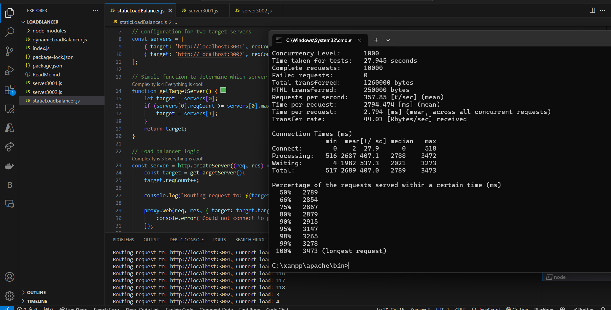
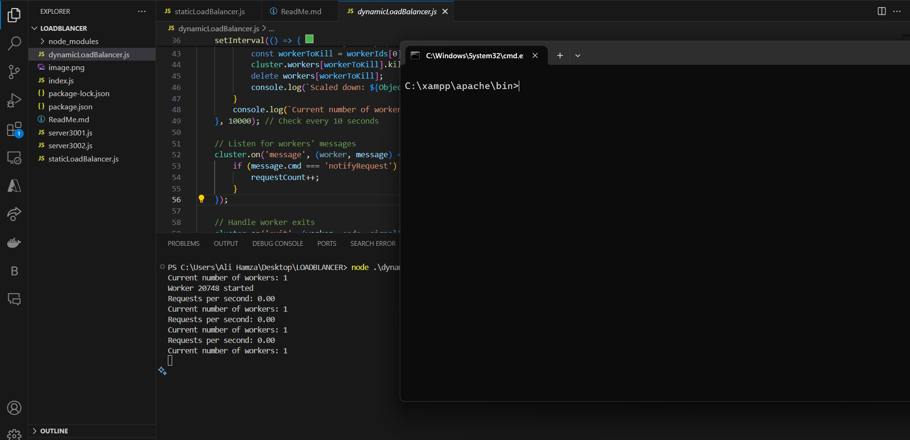
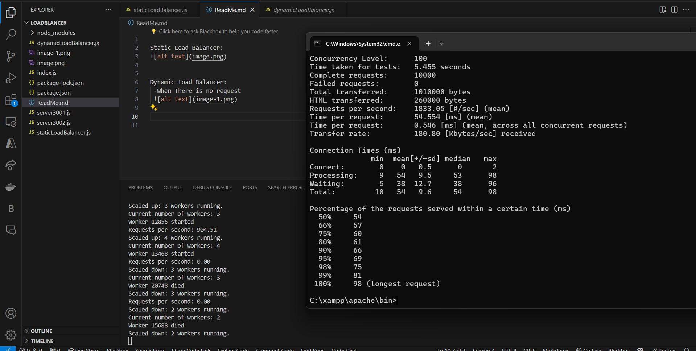

# Load Balancers Overview

## Static Load Balancer
Files involved:
- `server3001`
- `server3002`
- `staticLoadBalancer.js`

## Dynamic Load Balancer

### When there is no request

### When handling requests
- Scales up and down the servers dynamically

Files involved:
- `dynamicLoadBalancer.js`

## Working Explanation

### Static Load Balancer
- **Load Balancer:** Listens on port 8000. It decides which backend server to forward each request to based on their current load (`reqCount`). If server 3001 reaches its maximum request capacity (`maxReq`), new requests are forwarded to server 3002.

### Dynamic Load Balancer

#### Structure
The code is structured using Node.js' cluster module and divided into two parts:

##### Master Process Logic
- **Variable Initialization:**
  - `workers`: Tracks active worker processes.
  - `requestCount`: Counter for the number of requests since the last check.
  - `lastChecked`: Timestamp of the last load check.
- **Functions:**
  - `needMoreWorkers()`: Determines the need for more workers if requests per second since the last check exceed 10.
  - `needFewerWorkers()`: Checks if the requests per second are less than 1 to scale down.
- **Initial Worker Spawn:**
  - Starts by forking a single worker process and logs the current worker count.
- **Load Monitoring and Scaling:**
  - An interval checks every 10 seconds to decide on scaling up or down based on the load:
    - **Scale Up:** Forks a new worker if requests per second exceed 10 and the total number of workers is less than the number of CPU cores.
    - **Scale Down:** Kills the oldest worker if there is more than one and requests per second drop below 1.
  - Logs the current number of active workers.
- **Communication with Workers:**
  - Listens for messages from workers to increment `requestCount` whenever a new request is reported.
- **Handling Worker Exits:**
  - Monitors worker process exits, logs the event, removes the worker from the tracking object, and logs the updated worker count.

##### Worker Process Logic
- **HTTP Server Creation:**
  - Each worker creates an HTTP server that listens on port 8000.
  - Upon receiving a request, it notifies the master process by sending a `notifyRequest` message and then responds to the HTTP request with a message including the worker's process ID.

#### Execution Flow
- **Start:** Checks if it's being executed in the master process context.
- **Scaling Logic:** Scales up by adding more workers if the load is high, or scales down by terminating workers if the load is low.
- **Request Handling:** Each worker handles HTTP requests independently and reports each request to the master to help determine scaling needs.
